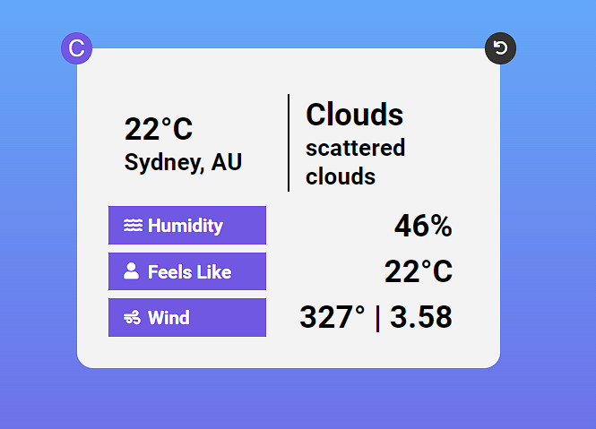

# Weather App - Odin Project
Search a location for weather data, displays relevant retrieved data

- retrieve data using fetch from OpenWeatherMap API 
- convert between celsius and fahrenheit
- bundled using webpack

[Live App](https://twnisa.github.io/weather-app/)

